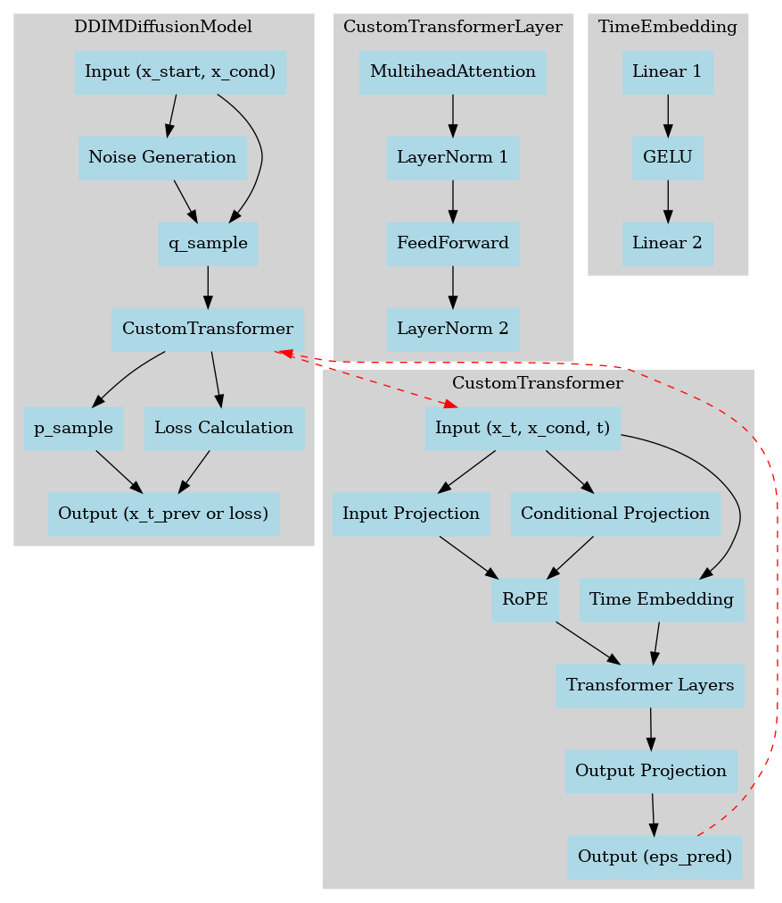
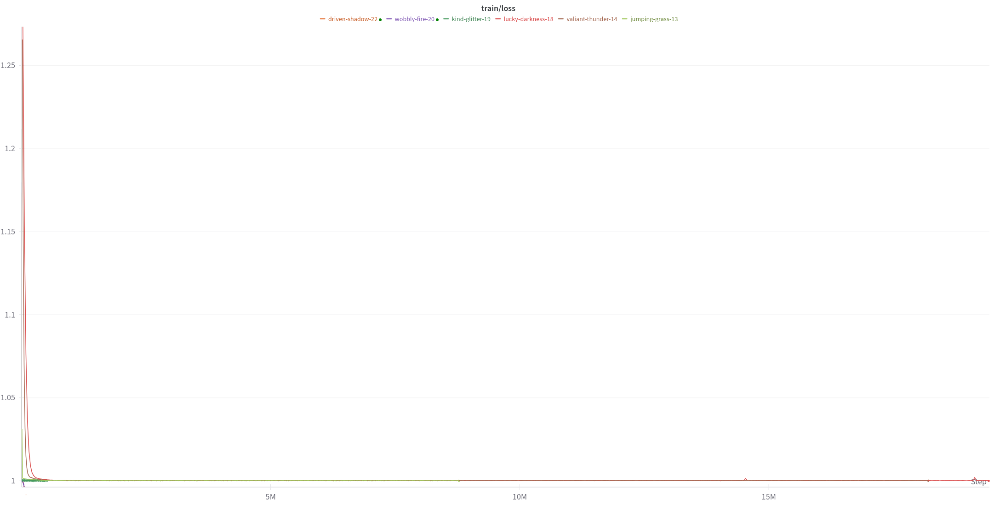
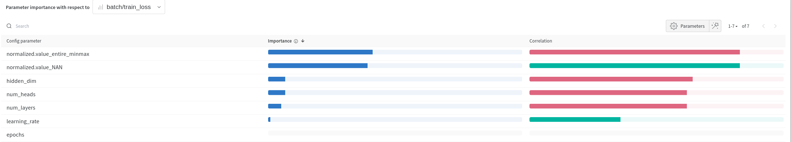
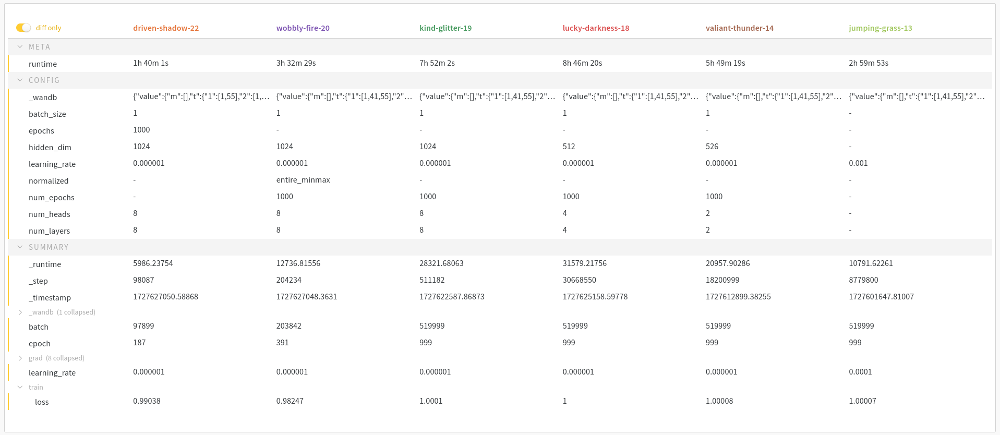

# Problem Statement

In mass spectrometry  (data-independent acquisition), the fragmentation signal derived from precursor ions is convoluted due to the presence of multiple fragment ions from different precursor ions. This highly multiplexed signal is difficult to interpret and presents a challenge in peptide identification. We hypothesize that we can utilize diffusion to extract a clean MS2 peak map from a highly convoluted raw MS2 peak map, by conditioning on the MS1 peak map.

Below, is a demonstration of a highly convoluted raw MS2 peak map.

# Solution

## Modified Transformer with Diffusion

## Example

### Our Query MS1 Peak Map

### Extracted clean MS2 Peak Map

  
  

### Sample MS1 with Predicted MS2 Peak Maps

   
   

  
  

## Performance

